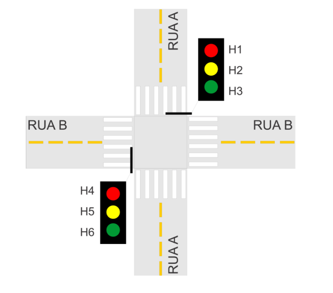
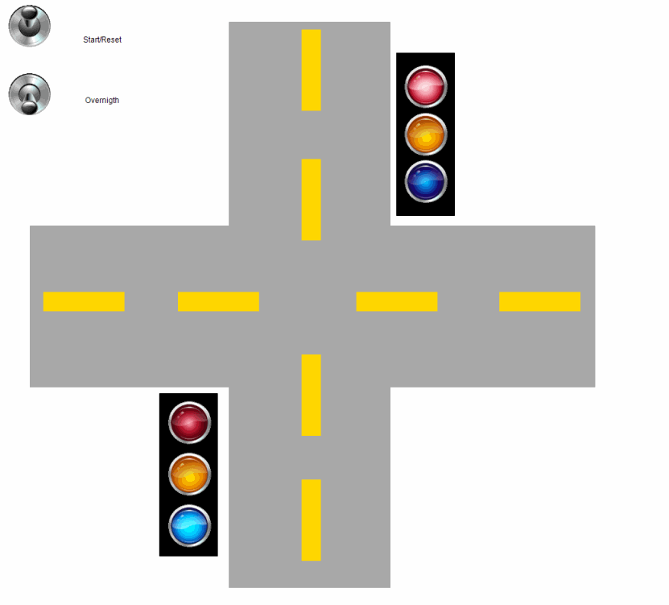
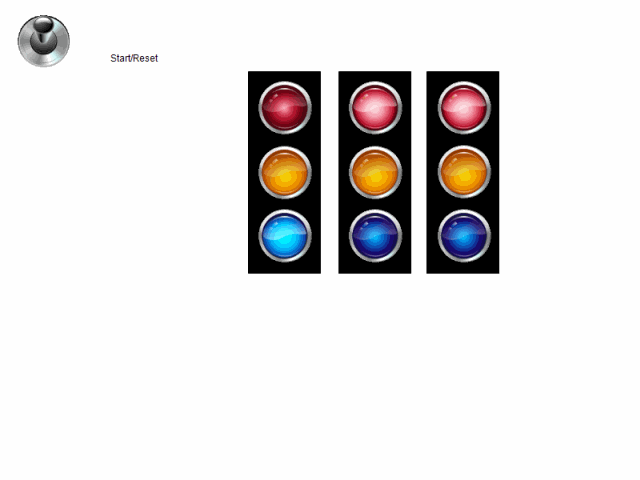

# Controlador Semáforo
Esse projeto consiste em desenvolver um programap para CLP que controle o semáfro em um cruzamento de duas vias de mão única.

Para isso, usaremos 3 linguagens diferentes:

- Ladder
- FBD
- SFC

O objetivo de utilizar essas linguagens é comparar a facilidade de resolver o problema em cada uma delas.

Além disso, usaremos 2 softwares e programação para CLP:

- CodeSys
- ZelioSoft

### Problema:



Figura 1: Semáforo cruzamento

Os requisitos são:

- A duração de H3 é igual a de H6, 20 segundos.
- H2 e H5 têm duração de 3 segundos.
- No horário 23:30-5:30, H2 e H5 devem piscar de forma intermitente com período de 2 segundos. H1, H3, H4 e H6 não devem funcionar nesse horário.
- Incluir uma entrada para controlar o início/reset do sistema.

## Linguagem Ladder usando CodeSys

### 2 Pontos:

Em Ladder usei as seguintes variáveis:

```sql
PROGRAM PLC_PRG
VAR
	start: BOOL;
	yellow: BOOL;
	red: BOOL;
	green: BOOL;
	
	yellow2: BOOL;
	green2: BOOL;
	red2: BOOL;
	
	overnight: BOOL;
	
	ton_0: TON;
	ton_1: TON;
	ton_2: TON;
	ton_3: TON;
	ton_4: TON;
	ton_5: TON;
	ton_6: TON;
	
	blink: BOOL;
	controller: BOOL;

END_VAR
```


Na primeira linha a variável `start` está numa ligação fechada pois ela é utilizada para dar um `RESET` nas variáveis que controla as luzes do semáforo.

A segunda linha, contém a variável como normalmente aberta, para quando o `start` for pressionado enquanto não estiver `yellow` nem `green`, dar um `SET` na variável `red`.


Da linha 3 à linha 8, utilizamos o temporizador `TON` que recebe como parâmetros de entrada um sinal que dá inicio a contagem e um valor de referência `T#23S`. Possui o sinal vermelho ficará ativo por 20 segundos (green) mais 3 segundos (yellow). Quando o tempo for atingindo, definido um `RESET` no red e um `SET` no `green` .


A partir da linha 9 começamos o controle do período nortuno. Onde deve ser desligado as luzes verdes e vermelhas equanto as amarelas piscam continuamente com um intervalo de 2 segundos.

### Simulação:

Criamos um ambiente visual utilizando as ferramentas do codeSys para ter uma simulação visual do projeto.



Figura 2: Objeto Visual 2 semáforos

### 3 Pontos

Outro objetivo do projeto era criação de um programa de semáforo para três vias (3 pontos) sem restrição horária, isto é, com outro sinal (H7, H8 e H9).  Para isso, criei mais 3 variáveis para o controle:

```sql
yellow3: BOOL;
green3: BOOL;
red3: BOOL;
```


Figura 3: Código Ladder para 3 semáforos

Com as novas variaveis, utilizeo os `TON` para controlar o tempo, a diferença é que agora eu defini um tempo maior em que cada sinal fica ativo em vermelho, totalizando 46 segundos.



Figura 4: Objeto visual 3 semáforos

## Linguagem de blocos FBD ZelioSoft

Agora iremos resolver o mesmo problema utilizando a linguagem de blocos FBD. Para isso, optamos por usar a ferramenta ZelioSoft pois ela representa as entradas e saídas do controlador tornando mais fácil esse tipo de programação:


Figura 5: FBD 2 Pontos

Para o problema de dois pontos, eu utilizei:

- Blocos BOOLEAN
- Portas OR
- Bloco TIMER AC

A lógica é, a resposta do bloco `SET` inicia a contagem de um temporizador e é ligado direto no boolen (1000) o boolen foi configurado para retornar 1 se (1000) e 0 se diferente. Logo, quando o temporizador atingir seu delay on de 20 segundos, será desligado a luz verde.

O meu botão configurado no I3 serve para ativar o modo noturno, ou seja, desligar as luzes verdes e vermelhas enquanto a luz amarela pisca. Para isso utilizei um temporizador com on delay de 2 segundos.

### 3 Pontos:

Para o problema com 3 semafóros eu usei exatamente a mesma lógica, agora com uma quantidade maior de blocos de função para controlar mais um semáforo em conjunto.


Figura 6: FBD 3 Pontos

### Entradas físicas


Figura 7: Inputs

### Saídas físicas


Figura 8: Outputs

## Linguagem SFC ZelioSoft

### 2 Pontos:

Com a linguagem SFC foi muito mais fácil pensar na lógica, isso porque, os blocos de STEP facilitam o trabalho nesse projeto de semafóros onde cada cor representa um step.


Figura 9: SFC 2 Pontos

Nesse caso, utilizei o bloco de passo inicial que recebe o sinal do SET. Em seguida utilizei um bloco de step OR. Onde o programa toma uma decisão:

- Se o botão overnight estiver pressionado então iniciar modo noturno.
- Se o botão overnight não estiver pressionado segue para o funcionamento normal.

### 3 Pontos:


Figura 10: SFC 3 Pontos

## Conclusão

Durante esse período, adquirimos uma valiosa experiência prática no desenvolvimento, utilizando ferramentas como o CODESYS e o ZelioSoft. Nossa principal tarefa envolveu a criação de um programa para controlar um semáforo com 2 ou 3 pontos, incluindo a função de operação noturna. No decorrer desse projeto, chegamos à conclusão de que é possível alcançar o mesmo resultado utilizando diferentes linguagens de programação. No entanto, notamos que a linguagem SFC se destacou como a opção mais intuitiva para criar a lógica necessária.